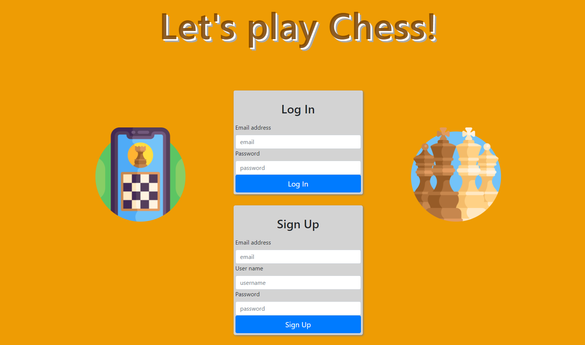
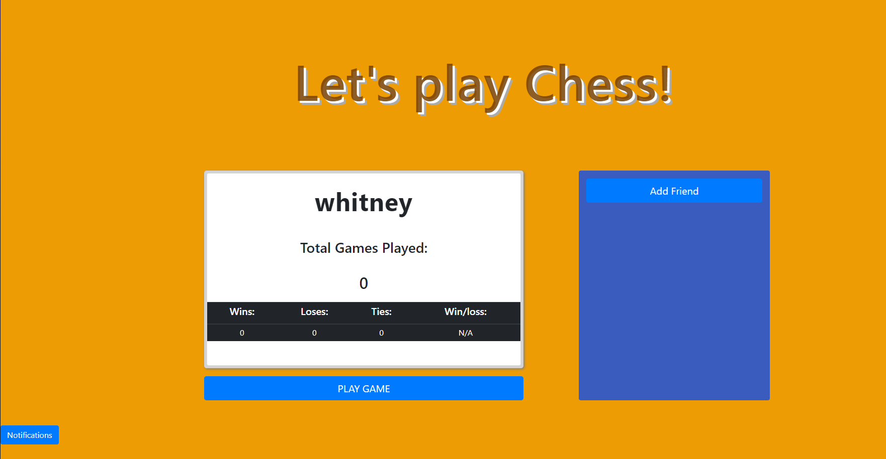

# Chess Game
## Description

Play chess with friends! We built this project so that you can play live chess with the people you want. Log into our website to see your chess scores and stats.  Add friends that are already registered on the platform! When you have a friend connection, a notification will appear and you can accept or decline the invite. If you want to start a game, click the start game button. This takes you to a lobby where you can invite them to a game of chess. When both players are in the lobby, click start game to see the game board.

Our website lets you play with just the people you want, instead of a computer or random stranger. 

## Table of Contents
  * [Usage](#usage)
  * [Screenshot](#screenshot)
  * [Resources](#resources)
  * [Contributions](#contributions)
  * [License](#license)
    
    
## Usage
  Visit our web app at:
  [Heroku Deployed Server]() 
  On our login page

  [Github Repo](https://github.com/lets-play-chess/chess-with-friends) 
        
## Screenshot

## Resources

Our server was built using the following npm modules: sequelize, dotenv, mysql2, bcrypt, & socket.io. 

Our new tech used was socket.io, which facilitates live notifications and game plays.

We used [Bootstrap](https://getbootstrap.com/docs/3.4/css/) as our CSS framework and rendered html through handlebars.

 
## Contributions

Server Routes and Game Logic: [Carsdan Dvorachek](https://github.com/ChuckDvchek)  

CSS & Handlebars: [Evelyn Maldonado](https://github.com/EvelynGMaldonado)   

Project Manager: [Kyle Bove](https://github.com/Kbove)   

Git Manager: [Whitney Kropat](https://github.com/wkropat)  
  
## License